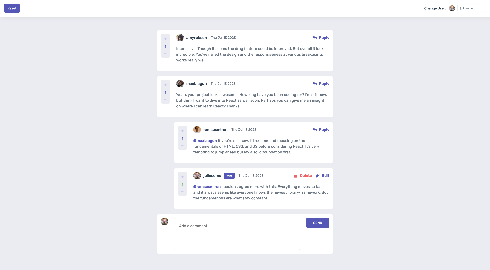

# Frontend Mentor - Interactive comments section solution

This is a solution to the [Interactive comments section challenge on Frontend Mentor](https://www.frontendmentor.io/challenges/interactive-comments-section-iG1RugEG9). Frontend Mentor challenges help you improve your coding skills by building realistic projects.

## Table of contents

- [Overview](#overview)
  - [The challenge](#the-challenge)
  - [Screenshot](#screenshot)
  - [Links](#links)
- [My process](#my-process)
  - [Built with](#built-with)
  - [What I learned](#what-i-learned)
  - [Continued development](#continued-development)
  - [Useful resources](#useful-resources)
- [Author](#author)

## Overview

### The challenge

**Users should be able to:**

- View the optimal layout for the app depending on their device's screen size
- See hover states for all interactive elements on the page
- Create, Read, Update, and Delete comments and replies
- Upvote and downvote comments
- **Bonus / IMPLEMENTED**: If you're building a purely front-end project, use `localStorage` to save the current state in the browser that persists when the browser is refreshed.
- **Bonus / IMPLEMENTED**: Instead of using the `createdAt` strings from the `data.json` file, try using timestamps and dynamically track the time since the comment or reply was posted.

**Additions:**

- A dropdown to change the active user
- A reset button to reset the app state

### Screenshot

### Links

- Solution URL: [https://www.frontendmentor.io/solutions/interactive-comment-section-built-with-reactjs-and-sass-NkH8CMWJ8a](https://www.frontendmentor.io/solutions/interactive-comment-section-built-with-reactjs-and-sass-NkH8CMWJ8a)
- Live Site URL: [https://interactive-comment-section-ai.netlify.app](https://interactive-comment-section-ai.netlify.app)

## My process

### Built with

- Semantic HTML5 markup
- CSS custom properties
- Flexbox
- CSS Grid
- Mobile-first workflow
- [React](https://reactjs.org/) - JS library
- [uuid](https://www.npmjs.com/package/uuid) - for creating unique keys of React list items

### What I learned

By building this challenge is learned more about how React works, especially the useRef hook that I used to reference DOM nodes in this app.

### Continued development

In the future I'd like to get more comfortable using React to build apps, but this challenge was a good way to practice what I already know and push myself further.

### Useful resources

On this [link](https://dev.to/gedalyakrycer/ohsnap-sass-folder-structure-for-react-483e) you can find the folder structure that I used to implement Sass in to this React project.

On this [link](http://getbem.com/) you can learn more about BEM naming convention that I used to name my classes in this project.

## Author

- Frontend Mentor - [@andrijaivkovic](https://www.frontendmentor.io/profile/andrijaivkovic)
- Twitter - [@AndrijaIvkovic1](https://twitter.com/AndrijaIvkovic1)
